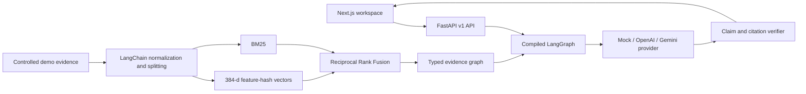
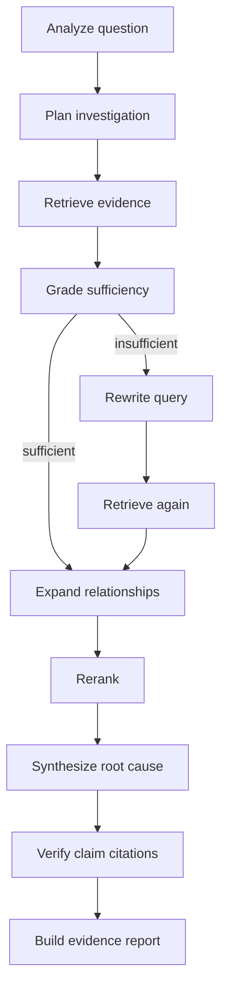

<div align="center">
  
  <h1>IncidentLens</h1>
  <p><strong>Find the change behind the failure—with inspectable evidence for every conclusion.</strong></p>
  <p>
    <a href="#run-locally">Run locally</a> ·
    <a href="#measured-retrieval">Benchmark</a> ·
    <a href="docs/06-system-architecture.md">Architecture</a> ·
    <a href="docs/10-security-threat-model.md">Threat model</a>
  </p>
</div>


IncidentLens is an evidence-first software incident investigator. It ingests source, logs, commits, deployments, release notes, issues, architecture documents, and prior incidents; retrieves across them with independent dense and sparse indexes; expands explicit evidence relationships; and uses a real LangGraph workflow to build a cited root-cause hypothesis.

The public demo is deterministic and requires no paid API. It does **not** hide a seeded answer in the UI: the report is produced from the indexed corpus, and removing key evidence changes the result in an integration test.

## Why this problem matters

Incident response is a causal reconstruction problem. Runtime evidence says *what* failed, source and commits say *what changed*, deployment metadata says *when*, and historical incidents show whether the signature has appeared before. A plausible summary without those links is difficult to defend.

IncidentLens keeps four things visible:

- the source behind each important claim;
- contradicting evidence and confidence boundaries;
- the corrective retrieval branch when initial evidence is weak;
- the exact retrieval benchmark used for quality claims.

## The built-in case

The synthetic checkout incident includes two services, a currency-normalization change, structured errors, a deployment, a commit diff, a release, an issue, healthy-gateway evidence, architecture documentation, and a previous incident with the same signature.

```text
Open IncidentLens
  → launch the checkout case
  → ask why failures rose after deployment
  → inspect deployment, commit, logs, code contract, and contradiction
  → open any evidence source or the LangGraph trace
```

| Landing | Mobile investigation |
|---|---|
|  |  |

## How IncidentLens works



### Data preparation

`parse → validate → normalize → clean → deduplicate → chunk → enrich → embed → index → graph-link`

LangChain `Document` and `RecursiveCharacterTextSplitter` are runtime-critical, not decorative imports. The local embedding implements LangChain's embeddings interface and maps normalized unigrams/bigrams into deterministic signed feature vectors. Cosine similarity is executed over stored vectors. It is intentionally smaller and less semantic than a neural embedding model; that limitation is measured and documented.

### Hybrid retrieval

BM25 preserves exact error signatures, hashes, and source identifiers. Vector search recovers normalized concepts. Reciprocal Rank Fusion combines their independent ranks without assuming comparable score scales. A deterministic reranker adds query coverage/source authority, then the evidence graph expands causal neighbors.

### LangGraph workflow



Every node appends a safe timing/decision trace. The forced-correction integration test proves the conditional rewrite and second retrieval path execute.

### Evidence graph

The graph represents typed, weighted, provenance-bearing relationships:

```text
deployment --deploys--> commit --changes--> source file
source file --calls--> adapter <--emitted_by-- error log
prior incident --same_signature--> error log
gateway health --contradicts_gateway_outage--> error log
```

## Measured retrieval

Generated from [`evaluation/results/latest.json`](evaluation/results/latest.json) with four committed queries and ground-truth IDs that are never indexed:

| Configuration | Recall@5 | Precision@5 | MRR | Evidence hit rate | Root-cause coverage |
|---|---:|---:|---:|---:|---:|
| Dense baseline | 0.3708 | 0.3000 | 0.3750 | 0.7500 | 1.0000 |
| Hybrid (BM25 + vector + RRF) | 0.6708 | 0.5000 | 0.7083 | 1.0000 | 1.0000 |
| Full pipeline (+ rerank + graph) | 0.6708 | 0.5000 | 1.0000 | 1.0000 | 1.0000 |

On this small synthetic dataset, hybrid retrieval improves Recall@5 over the bundled dense baseline. The full pipeline improves first-relevant rank. These numbers do **not** establish general incident-resolution accuracy.

Reproduce them:

```bash
python -m backend.app.evaluation.runner
git diff --exit-code evaluation/results/latest.json
```

## Technology

| Layer | Implementation |
|---|---|
| Web | Next.js 16.3, React 19.2, TypeScript 6, App Router |
| API | Python 3.12+, FastAPI 0.141, Pydantic v2 |
| RAG | LangChain Core 1.6, LangChain Text Splitters 1.1 |
| Orchestration | LangGraph 1.2 compiled state graph |
| Retrieval | feature-hash embeddings, cosine vector search, BM25, RRF, deterministic reranking |
| Relationships | in-memory typed evidence graph |
| Providers | deterministic mock, official OpenAI SDK, official Gemini SDK |
| Persistence | SQLite migrations/local repository; pgvector-compatible protocol and local Docker target |
| Quality | pytest, Ruff, mypy, Vitest, Testing Library, Playwright |
| Delivery | GitHub Actions and separate Vercel frontend/API projects |

## Repository map

```text
backend/app/        FastAPI, ingestion, retrieval, graph, LangGraph, providers
backend/tests/      unit, integration, API, and evaluation tests
frontend/           Next.js application and component tests
demo/               only source of seeded incident evidence
evaluation/         separate ground truth and generated metrics
tests/e2e/          desktop and mobile browser system test
docs/               PRD, architecture, ADRs, threat model, reports, screenshots
scripts/            CI, security, and release utilities
```

## Run locally

### Prerequisites

- Node.js 22+ (validated with 24.15)
- pnpm 11
- Python 3.12–3.14 (validated with 3.13)

```bash
git clone https://github.com/Niloy-Bhuiyan/IncidentLens.git
cd IncidentLens
cp .env.example .env
pnpm install
python -m pip install -e "backend[dev]"
```

Start both services:

```bash
make dev
```

Or run them separately:

```bash
python -m uvicorn backend.app.main:app --reload --port 8000
pnpm --dir frontend dev
```

Open [http://localhost:3000](http://localhost:3000). API documentation is at [http://localhost:8000/docs](http://localhost:8000/docs).

### Environment variables

| Variable | Required | Default/purpose |
|---|---|---|
| `INCIDENTLENS_LLM_PROVIDER` | No | `mock`; selects server default |
| `OPENAI_API_KEY` | OpenAI mode only | Official SDK credential, backend only |
| `GEMINI_API_KEY` | Gemini mode only | Official SDK credential, backend only |
| `INCIDENTLENS_ALLOWED_ORIGINS` | Production | Exact frontend origins |
| `INCIDENTLENS_DATABASE_URL` | No | Local relational storage target |
| `NEXT_PUBLIC_API_BASE_URL` | Yes in deployment | Public FastAPI base URL |

The application never pretends a missing provider call succeeded. Selecting an unconfigured hosted provider produces a typed `503`; mock mode remains available.

## Quality gates

```bash
make test       # pytest + Vitest
make lint       # Ruff + mypy + ESLint + TypeScript
make eval       # deterministic benchmark
make security   # local secret scan + dependency audits
pnpm e2e        # real backend/frontend, desktop + mobile Chromium
pnpm build      # production Next.js build
```

Current verified local results:

- backend: 19 tests passed; Ruff and strict mypy passed;
- frontend: 5 tests passed with 70% statement / 72.5% line coverage; ESLint and TypeScript passed;
- E2E: 2 projects passed (desktop Chromium and Pixel 7 emulation);
- production build: all routes compiled successfully;
- browser visual audit: no horizontal overflow or console warnings/errors at the inspected breakpoints.

See the dated [system test report](docs/reports/system-test-report.md), [security audit](docs/reports/security-audit.md), and [production smoke test](docs/reports/production-smoke-test.md) for executed evidence and any remaining blockers.

## Security model

- Evidence, questions, and provider output are untrusted data.
- The API accepts a built-in demo ID—not filesystem paths, URLs, uploads, or archives.
- Source is read only from a resolved allowlisted root and is never executed.
- React renders evidence as text; no `dangerouslySetInnerHTML` is used.
- Request/body/file limits, exact-origin CORS, rate limiting, CSP, security headers, request IDs, and safe errors are implemented.
- Prompt versions state the instruction boundary; final citation IDs must belong to retrieved evidence.
- `.env` and credentials are ignored; CI runs working-tree/history secret scans and dependency audits.

Review the full [threat model](docs/10-security-threat-model.md). Passing the included controls does not make the project universally secure; multi-tenant auth, durable rate limiting, and arbitrary uploads are deliberately out of scope.

## Deployment

The monorepo deploys as two Vercel projects:

1. the FastAPI project from the repository root (`api/index.py`);
2. the Next.js project rooted at `frontend/`, with `NEXT_PUBLIC_API_BASE_URL` pointed at the API.

This keeps framework runtimes independently diagnosable. The seeded corpus is bundled read-only and lazily reindexed after a cold start. Arbitrary investigation history is process-local in v1.

Production URLs are added here only after actual smoke verification.

## Limitations and roadmap

Read [known limitations](docs/15-known-limitations.md) before interpreting the demo or metrics. Near-term improvements are a durable PostgreSQL/pgvector adapter, a stronger optional local neural embedding, authenticated user namespaces, and controlled direct file ingestion with a separate upload threat model.

IncidentLens does not execute code, connect to production, remediate systems, guarantee root cause, or replace observability tooling.

## Documentation

- [Product vision](docs/00-product-vision.md) and [PRD](docs/01-prd.md)
- [System architecture](docs/06-system-architecture.md) and [AI/RAG architecture](docs/09-ai-rag-architecture.md)
- [API design](docs/08-api-design.md) and [data architecture](docs/07-data-architecture.md)
- [Testing strategy](docs/11-testing-strategy.md) and [release checklist](docs/14-release-checklist.md)
- [Architecture Decision Records](docs/adr/)

## License

[MIT](LICENSE) © 2026 Niloy Bhuiyan

