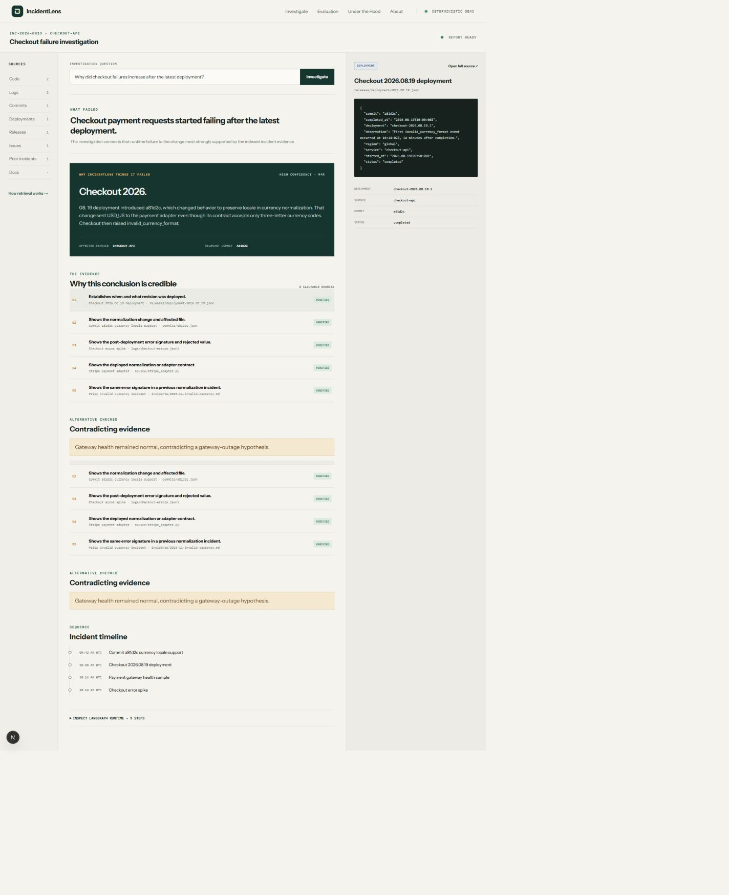
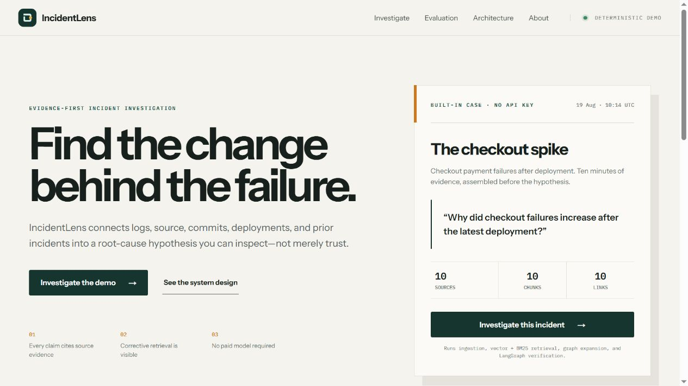
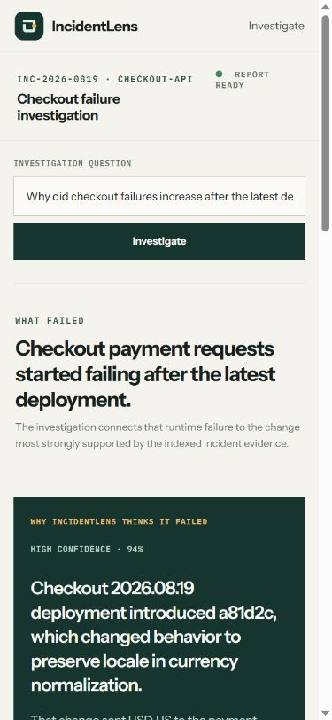
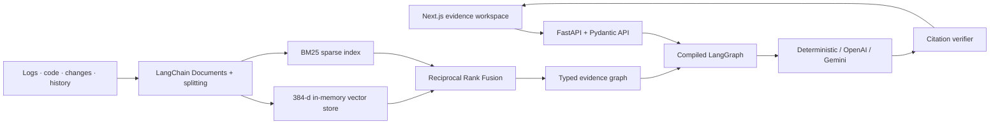
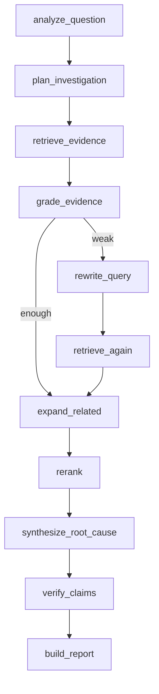

<div align="center">
  
  <h1>IncidentLens</h1>
  <p><strong>AI incident investigation backed by real engineering evidence.</strong></p>
  <p>
    <a href="https://incidentlens-nine.vercel.app">Live demo</a> ·
    <a href="#actual-benchmark">Benchmark</a> ·
    <a href="docs/06-system-architecture.md">Architecture</a> ·
    <a href="docs/01-prd.md">PRD</a>
  </p>
</div>



Your app broke after a deployment. IncidentLens investigates the logs, source code, recent commits, deployment metadata, and previous incidents to find the most likely reason—then lets you open the evidence behind every claim.

**Try it:** [Investigate the hosted checkout incident](https://incidentlens-nine.vercel.app/investigations/demo). No API key or paid model is required.

```text
WHAT FAILED
    ↓
WHY INCIDENTLENS THINKS IT FAILED
    ↓
THE LOGS, CODE, COMMIT, DEPLOYMENT, AND HISTORY THAT SUPPORT IT
```

This is not a chatbot wrapper. It is a typed Python/Next.js investigation system with controlled data preparation, hybrid RAG, a compiled LangGraph workflow, replaceable model providers, evidence relationships, reproducible evaluation, and explicit security boundaries.

## The 30-second demo

The built-in case follows a checkout failure spike after release `2026.08.19`:

1. Open the production site and select **Investigate Demo Incident**.
2. The API rebuilds the controlled incident index and executes the real investigation graph.
3. The report connects deployment → commit → currency-normalization change → rejected Stripe request.
4. Select any reason, timeline item, or source type to inspect its raw log, diff, code, deployment record, or previous incident.
5. Expand the runtime trace to see every completed LangGraph node, including corrective retrieval when triggered.

| Landing | Mobile investigation |
|---|---|
|  |  |

The evidence is synthetic and clearly labeled. The pipeline and metrics are real.

## Architecture



### Data preparation and LangChain

`parse → validate → clean → normalize → deduplicate → chunk → metadata → embed → index → graph-link`

[`backend/app/ingestion/pipeline.py`](backend/app/ingestion/pipeline.py) creates LangChain `Document` objects and uses `RecursiveCharacterTextSplitter` in the runtime ingestion path. Metadata and content hashes remain attached through indexing and retrieval. Ground-truth answers live under `evaluation/` and are never indexed.

### Hybrid RAG and vector storage

[`backend/app/retrieval/engine.py`](backend/app/retrieval/engine.py) executes three distinct stages:

- a deterministic 384-dimensional feature-hash embedding and cosine vector search;
- BM25 for error codes, hashes, symbols, and exact operational language;
- reciprocal-rank fusion, bounded reranking, and evidence-graph expansion.

The hosted demo uses a **real in-process vector store**, not a managed vector database and not a neural embedding service. That choice keeps the public demo reproducible and free. PostgreSQL + pgvector is a documented future scale path, not a current implementation claim; see [ADR-002](docs/adr/ADR-002-vector-store.md).

### LangGraph controls the investigation

[`backend/app/agents/graph.py`](backend/app/agents/graph.py) compiles and runs this state machine:



Every node appends a sanitized trace. An integration test asserts that `grade_evidence → rewrite_query → retrieve_again` actually executes; another removes the key commit and proves the synthesis changes.

### Evidence graph

The graph makes causal neighbors useful instead of treating the corpus as unrelated chunks:

```text
deployment --deploys--> commit --changes--> source file
source file --calls--> adapter <--emitted_by-- error log
prior incident --same_signature--> error log
gateway health --contradicts_gateway_outage--> error log
```

### Model-provider architecture

| Provider | Purpose | Implementation |
|---|---|---|
| OpenAI | Real supported integration | Official async SDK, configured model, environment-only key, 20 s timeout, two SDK retries, Pydantic structured output, safe translated errors |
| Gemini | Real alternate integration | Official Google GenAI SDK, configured model, JSON-schema output, timeout, safe errors |
| Deterministic demo | Hosted free mode and repeatable tests | Derives the report only from supplied ranked evidence and abstains when the corpus does not support the question |

The hosted site defaults to deterministic mode so visitors do not consume paid credits. It does **not** claim an OpenAI call occurred. All three providers run behind the same retrieval, LangGraph, and citation-verification path. Selecting an unconfigured provider returns a typed `503`; there is no disguised fallback.

Prompts are genuinely versioned under [`backend/app/prompts/`](backend/app/prompts/). They mark retrieved text as untrusted data and constrain citations to supplied evidence IDs.

See the live [Under the Hood](https://incidentlens-nine.vercel.app/under-the-hood) map and [FastAPI contract](https://incidentlens-api-delta.vercel.app/docs).

## Actual benchmark

The committed v2 benchmark contains **32 seeded questions**: 30 retrieval questions and two insufficient-evidence/abstention cases. It covers exact error codes, semantic descriptions, source symbols, commits, deployments, releases, historical incidents, temporal clues, multi-hop relationships, distracting gateway evidence, and unsupported questions.

Results below were generated by executing the current code from source against committed ground truth:

| Configuration | Recall@5 | Precision@5 | MRR | Evidence hit rate | Root-cause coverage | Abstention |
|---|---:|---:|---:|---:|---:|---:|
| Dense-only vector retrieval | 0.6778 | 0.3200 | 0.4359 | 0.9333 | 0.6778 | N/A |
| Hybrid vector + BM25 + RRF | 0.8167 | 0.3933 | 0.8306 | 1.0000 | 0.8167 | N/A |
| Full LangGraph + rerank + graph | 0.8389 | 0.4067 | 0.8500 | 1.0000 | 0.8389 | 1.0000 (2/2) |

On this controlled corpus, hybrid retrieval materially improves Recall@5 and MRR over dense-only retrieval; the full pipeline improves them again and abstains on both unsupported questions. These results do **not** establish general production incident accuracy.

Reproduce and compare the stable fields:

```bash
python -m backend.app.evaluation.runner
python scripts/ci/verify_benchmark.py
```

Source: [`evaluation/datasets/incident-retrieval-v2.json`](evaluation/datasets/incident-retrieval-v2.json) and [`evaluation/results/latest.json`](evaluation/results/latest.json).

## Technology map

| Requirement | Genuine implementation |
|---|---|
| Python / APIs | Python 3.12+, FastAPI 0.141, Pydantic v2 contracts and middleware |
| AI / RAG | controlled evidence preparation, dense + sparse retrieval, fusion, reranking, citations |
| LangChain | runtime `Document`, text splitting, and embeddings interface |
| LangGraph | compiled conditional investigation graph with a tested correction branch |
| Vector search | computed vectors, in-memory index, cosine similarity; accurately bounded above |
| OpenAI | official SDK adapter with structured output and mocked contract tests |
| Prompt engineering | purpose/version directories, untrusted-evidence boundary, citation verification |
| Evaluation | 32-query ground truth, Recall@5, Precision@5, MRR, hit rate, coverage, abstention |
| Web | Next.js 16.3, React 19.2, TypeScript 6, accessible responsive evidence workspace |
| Delivery | GitHub Actions plus separately deployed Vercel web/API projects |

## Repository map

```text
backend/app/        FastAPI, ingestion, retrieval, evidence graph, LangGraph, providers
backend/tests/      unit, integration, API, provider, security, and evaluation tests
frontend/           Next.js product, Under the Hood proof, and component tests
demo/               only indexed synthetic incident evidence
evaluation/         separate ground truth and generated metrics
tests/e2e/          desktop and mobile browser journey
docs/               PRD, architecture, ADRs, threat model, release evidence
scripts/            benchmark consistency and security gates
```

## Run locally

Prerequisites: Node.js 22+, pnpm 11, and Python 3.12–3.14.

```bash
git clone https://github.com/Niloy-Bhuiyan/IncidentLens.git
cd IncidentLens
cp .env.example .env
pnpm install
python -m pip install -e "backend[dev]"
make dev
```

Or start the services separately:

```bash
python -m uvicorn backend.app.main:app --reload --port 8000
pnpm --dir frontend dev
```

Open [localhost:3000](http://localhost:3000) and [localhost:8000/docs](http://localhost:8000/docs).

### Environment variables

| Variable | Required | Purpose |
|---|---|---|
| `INCIDENTLENS_LLM_PROVIDER` | No | Defaults to `mock` |
| `INCIDENTLENS_OPENAI_API_KEY` | OpenAI mode only | Server-only SDK credential |
| `INCIDENTLENS_OPENAI_MODEL` | No | Defaults to `gpt-5-mini` |
| `INCIDENTLENS_GEMINI_API_KEY` | Gemini mode only | Server-only SDK credential |
| `INCIDENTLENS_GEMINI_MODEL` | No | Defaults to `gemini-2.5-flash` |
| `INCIDENTLENS_ALLOWED_ORIGINS` | Production | Exact frontend origins |
| `INCIDENTLENS_DATABASE_URL` | No | Local SQLite relational target |
| `NEXT_PUBLIC_API_BASE_URL` | Deployment | Public FastAPI base URL; never a provider secret |

## Quality and security

```bash
make test
make lint
make eval
make security
pnpm e2e
pnpm build
```

The release gate covers backend unit/API/integration/provider tests, corrective LangGraph retrieval, retrieval mutation, frontend interaction/error tests, desktop/mobile E2E, production build, working-tree/history secret scans, Python/JavaScript dependency audits, prompt injection, XSS rendering, traversal-shaped IDs, body limits, SSRF surface review, headers, and exact-origin CORS.

Security boundaries:

- questions, evidence, and provider output are untrusted;
- the API accepts one controlled demo ID, not paths, URLs, uploads, or archives;
- evidence is read from a resolved allowlisted root and never executed;
- React renders source as text; no `dangerouslySetInnerHTML` is used;
- provider keys remain backend-only and safe logs never include prompts, evidence, or credentials;
- final citation IDs must exist in the retrieved evidence allowlist.

Read the [threat model](docs/10-security-threat-model.md), [test strategy](docs/11-testing-strategy.md), [system test report](docs/reports/system-test-report.md), [security audit](docs/reports/security-audit.md), and [production smoke report](docs/reports/production-smoke-test.md).

## SDLC evidence

- [Product vision](docs/00-product-vision.md), [PRD](docs/01-prd.md), [functional](docs/02-functional-requirements.md), and [non-functional requirements](docs/03-non-functional-requirements.md)
- [System architecture](docs/06-system-architecture.md), [data architecture](docs/07-data-architecture.md), and [AI/RAG architecture](docs/09-ai-rag-architecture.md)
- [API design](docs/08-api-design.md), [testing strategy](docs/11-testing-strategy.md), and [release checklist](docs/14-release-checklist.md)
- [Architecture Decision Records](docs/adr/) and [hostile audit](docs/reports/hostile-final-audit.md)

## Limitations

- The evidence and benchmark are synthetic and limited to one controlled checkout corpus.
- Feature-hash embeddings are deterministic and cheap but less semantic than neural embeddings.
- The hosted vector and evidence-graph indexes are rebuilt in memory after a serverless cold start.
- Investigation history is process-local; a direct URL may rebuild the demo rather than retrieve a durable record.
- The public demo has no authentication or arbitrary customer-data ingestion.
- OpenAI and Gemini adapters are tested without spending paid credits; provider quality is not part of the deterministic benchmark.

IncidentLens does not execute source, connect to production systems, remediate incidents, guarantee root cause, or replace observability tooling. See [known limitations](docs/15-known-limitations.md).

## License

[MIT](LICENSE) © 2026 Niloy Bhuiyan
