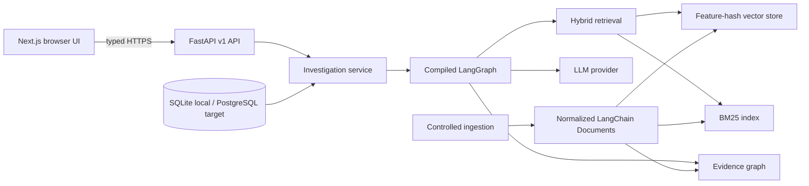

# System Architecture

## Context and quality drivers

IncidentLens must prove its retrieval and orchestration behavior on a small corpus, run without paid services, expose provenance, and remain deployable within serverless limits. Auditability, deterministic behavior, and replaceable boundaries matter more than horizontal scale in v1.

## Runtime view

## Components

- **Frontend:** Next.js App Router pages, typed fetch client, workspace/evidence/timeline components, and static explanatory pages. It contains no secret or root-cause fixture.
- **API:** FastAPI routes, Pydantic contracts, request-ID/security middleware, consistent errors, and OpenAPI.
- **Ingestion:** validates an allowlisted manifest, parses controlled formats, normalizes, cleans, hashes/deduplicates, uses LangChain document/splitting abstractions, enriches metadata, embeds, indexes, and links graph entities.
- **Retrieval:** BM25 sparse search, cosine search over computed dense feature-hash embeddings, reciprocal-rank fusion, deterministic reranking, and graph expansion.
- **Investigation:** a compiled LangGraph analyzes, plans, retrieves, grades, conditionally rewrites/retrieves again, expands, reranks, synthesizes through a provider, verifies citations, and builds the response.
- **Providers:** deterministic evidence-driven default plus official OpenAI and Gemini clients behind one protocol.
- **Persistence:** in-process demo indexes for serverless portability and SQLite relational repository/migrations for local runs. PostgreSQL/pgvector is the production-growth path, not a v1 deployment claim.

## Deployment view

The private GitHub monorepo feeds two Vercel projects: `incidentlens-api` rooted at `backend/` and `incidentlens` rooted at `frontend/`. The frontend receives only `NEXT_PUBLIC_API_BASE_URL`; backend secrets remain server-side. CORS allows the exact production frontend and local development origin.

## Failure behavior

Invalid inputs fail before side effects. Unknown evidence/investigations return typed 404s. Provider configuration failures return 503. Unhandled failures emit a request ID and safe message. A cold backend process deterministically rebuilds the small demo index.

## Architectural constraints

No arbitrary code execution, archive extraction, remote URLs, client secrets, hidden answers, or durable multi-tenant claims. The serverless demo is intentionally stateless across cold starts.

