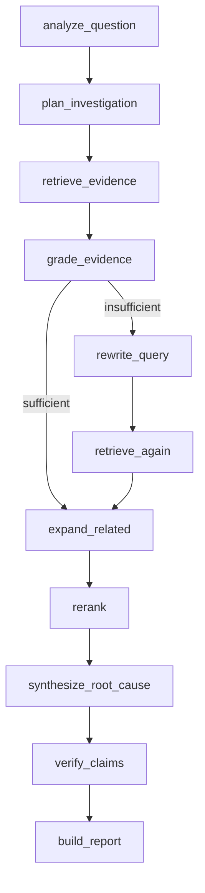

# AI and RAG Architecture

## Ingestion

`parse → validate → normalize → clean → deduplicate → chunk → enrich → embed → index → graph-link`

Parsers turn controlled artifacts into a common evidence record. LangChain `Document` objects and `RecursiveCharacterTextSplitter` are runtime-critical for chunking. Metadata remains attached through embedding and retrieval.

## Dense retrieval

The default `LocalHashEmbeddings` implements the LangChain embeddings interface. It lowercases/normalizes engineering synonyms, hashes unigrams/bigrams into a fixed dense vector, applies signed log-scaled term counts, and L2 normalizes it. Cosine similarity over stored vectors is genuine vector retrieval, deterministic, CPU-friendly, and serverless-safe. It is lexical/feature-based—not a neural semantic model—and that limitation is explicit.

## Sparse, fusion, and reranking

BM25 uses corpus term frequencies and document lengths. Reciprocal Rank Fusion combines independent dense and sparse ranks with `k=60`. Reranking adds bounded exact error-signature, temporal/change-intent, source-authority, and graph-neighbor signals; all score components are exposed in tests.

## Evidence graph

Nodes represent evidence plus service/file/symbol/commit/deployment/error-signature/issue/incident/log-event entities. Typed weighted edges are derived from manifest relationships and metadata. Graph expansion adds directly related evidence after initial retrieval and reranking rewards causal paths such as deployment → commit → file → error event.

## LangGraph runtime

Every node appends a sanitized transition with duration and summary. Sufficiency requires source diversity, a runtime signal, a change/deployment signal, and minimum relevance. The corrective branch uses incident context and missing evidence categories; tests force and naturally trigger it.

## Providers and prompts

`LLMProvider` returns a structured draft plus explicit provider/usage metadata. `DeterministicMockProvider` derives claims only from supplied ranked evidence and changes output when evidence changes. `OpenAIProvider` uses the official async SDK with timeout, bounded retries, and structured response parsing. `GeminiProvider` is the alternate official SDK implementation. No missing-provider fallback is labeled as a provider success.

Prompts live under `backend/app/prompts/<purpose>/<version>.md`, declare input/output boundaries, and tell providers to treat evidence as untrusted data. The compiled prompt includes only selected evidence and never tool/system secrets.

## Evaluation

Thirty committed retrieval questions and two unsupported questions compare dense-only, hybrid, and the actual LangGraph + rerank + graph pipeline using Recall@5, MRR, Precision@5, hit rate, root-cause evidence coverage, and full-pipeline abstention. Categories cover exact signatures, semantic descriptions, source, change/deployment, history, temporal, multi-hop, and misleading evidence. Ground truth is separate from demo content and is never indexed.

